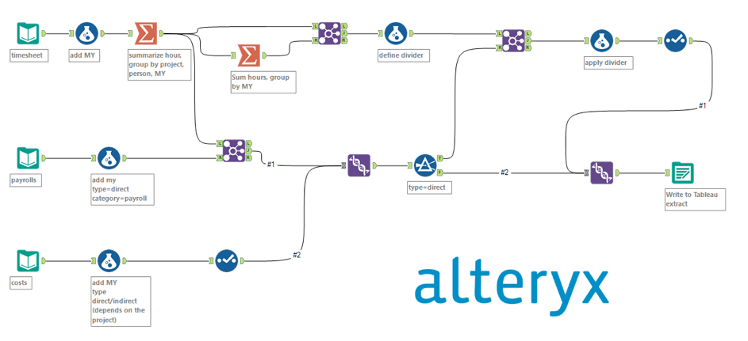

*Ceci est un mémo pour presenter un peu, l'outil d'ingénieurie de données, Alteryx et avoir de bonnes bases*.

# INTRODUCTION A ALTERYX

## Presentation de Alteryx

*Plantons le décor*.

Nous sommes au Lycée DC, une école qui collecte des données  auprès de différents départements, y compris les resultats des examens de ses élèves.
Elle veut obtenir des informations pertinantes à partir des données, et donc elle vous embauche en tent qu'analyste pour l'aider à le faire.

**Le probleme :** 
Vous devez combiner les données de différents departements.
Commençons par les données de test des étudiants et les données pour développer les insights à partager avec la direction de l'école. Les données sont mis à jour mensuellement, l'automatisation est donc une clé.

La direction aimerait également avoir une visibilité sur votre travail.

**La solution :**
Une solution pour resoudre ce problème est **ALTERYX Designer Desktop**.

***Qu'est-ce que ALTERYX Designer Desktop ?***

Il s'agit de l'un des principaux produits proposées par ALTERYX, une plateforme d'édition et analyse de données pour pour les entreprises et particuliers visant à les aider à donner du sens à leur données.

***Mais pourquoi ALTERYX Designer Desktop est-il le bon outil pour vous aider dans votre travail au Lycée DC ?***

Vous pouvez le considerer comme un laboratoire numérique. Vous pouvez y expérimenter différents éléments de données, outils pour explorer vos données et découvrir des insights, un peu comme un scientifique qui expérimente des produits chimiques dans son laboratoire. 

***Alors que faire exactement ALTERYX Designer Desktop ?***

- Il est conçu  pour gérer de grands ensembles de données sans effort et permet aux utilisateur de nettoyer, transformer et analyser des données provenant de diverses sources.

- Il prend en charge diverses sources de données, des bases de données aux plateformes de medias sociaux.
- Il est facile à installer et configurer, ce qui le rend idéal pour une mise en oeuvre au Lycée DC.

***Pourquoi utiliser ALTERYX Designer Desktop et non un autre ?***
- Il se distingue par sa conception glisser-déposer, permettant aux utilisateurs d'effectuer facilement des tâches de données et  de créer des flux de travail. Cela le rend accéssible à tout type d'utilisateur. 
- Il est essentiellement no-code et convivial.
- Il permet également traiter rapidement de grands ensembles de données, accélérant ainsi toutes les taches liées aux données.
- Il est par conséquent utilisé dans divers secteurs, de la santé au commerce de détail, et par divers rôles, notamment ceux de d'analyste de données, consultant BI et bien dautres.

***La principale façon de travailler avec ALTERYX Designer Desktop consiste à créer des flux de travail.***

**Un flux de travail** est un peu comme une recette.
Tout comme une recette vous guide à travers les étapes de preparation d'un gateau, un flux de travail dans Alteryx Dedigner vous guide à travers les étapes de traitement et d'analyse de données.
Traiter et analyser des données dans Alteryx Designer est similaire à la préparation d'un gâteau.

- La première étape, rasembler les ingrédients; Cela revient dans Alteryx à vous connecter aux données.
- Le seconde consiste à utiliser différents ustensiles pour melanger, combiner et modifier vos ingrédients. Alteryx dispose également d'outils qui permettent de preparer et modifier les données.

- Enfin, vous utiliserz des ustensiles pour preparer et cuire votre gâteau. Dans Alteryx également, des outils spécifiquement pour analyser les données produire des insights pertinants.

Ces différents outils utilisés pour créer flux de travail se trouvent dans la palette d'outils, chacun ayant une fonction bien spécifique.

*Les flux de travail sont facilement automatisable et les processus appliqués sont visibles pour les utilisateur.*

## La Navigation Dans Alteryx Designer Desktop

**Alteryx Designer Desktop** a une interface qui comporte quatre(04) principaux composants utilisés pour créer des flux de travail.

1. **La palette d'outils** : contient tous les outils nécessaires pour importer et gérer des données.

Tous les outils sont divisés en catégories par rapport à leurs fonctions. Chaque catégorie a sa propre couleur et sa propre forme d'outil, ceci pour faciliter la tâche et comprendre le flux de manière global simplement à regarder.

2. **Le Canevas** :  C'est l'endroit où vous pouvez utiliser les outils pour créer un flux de travail afin d'éffectuer les taches de données.
Il existe plusieurs façon d'y ajouter un outil, via:
-  Glisser-déposer l'outil depuis la palette d'outil
- Clic droit de la sourie dans un espace vide du canevas
- Rechercher l'outil dans la barre de recheche(située dans le supérieur droit de la palette d'outil)  et le glisser sur dans le canevas.

3. **La fenètre de configuration** : Permet de configurer chaque outil dans le Canevas afin d'adapter un flux de travail au besoin. Les composants de cette fenètre varient en fonction de l'outil séléctionné. Lorsqu'il y a une erreur dans la configuration d'un outil, vous pourrez constater un "**!**" rouge sur l'outil.

4. **La fenètre de résultats** : Permet, intuitivement, d'afficher les resultats des flux.

## Utilisation des outils dans Alteryx Designer

Lorsque vous utilisez la fonction **Input Data** de l'outil **In/out** pour importer des données, celle-ci n'affiche que le premier Méga Octet de votre ensemble de données. Un outil différent est requis pour afficher l'ensemble des données complet dans la fenètre des résultats, ainsi que les informations supplementaires, telles que les profils de données d'un ensemble de données.

Cela se fait avec l'outil **Parcourir/Browse 👀** en le faisant glisser vers le Canevas et le connectant avec l'outil déjà présent dans le canevas via les encres d'entrée et sortie.

Quelque soit l'outil selectionné, il est également possible de voir les metadonnées de notre ensemble de données en cliquant sur le boutton Metadonnées dans la fenêtre des resultats.

Tout autre ajout d'outil au Canevas se fait par le même procédé, c'est seulement la configuration de l'outil qui change.

# PREPARATION DES DONNEES DANS ALTERYX DESIGNER

### C'est quoi la préparation des données et pourquoi est-elle nécessaire !?

C'est une étape cruciale de l'analyse de données qui implique le nettoyage, la transformation et l'organisation ou gestion des données brutes.

Ces données propres et de meilleurs qualité sont essentielles pour garantir des resultats d'analyse  précis et significatifs.

Certaines tâches que nous pourrions effectuer pour preparer et nettoyer les données incluent de :
- s'assurer qu'elles soient exempt des valeurs manquantes, des fautes de frappe et d'entrée en double.
- Confirmer que les données sont pertinantes.
- s'assurer que les types de données corrects sont appliqués aux colonnes.
- Il est essentiel d'utiliser des noms courts et descriptifs pour les colonnes et les tables.

Préparer les données dès le départ vous évite les surprises lors des analyses, vous permet de travailler plus éfficacement, posant les bases de conclusions éclairées et une prise de décision éfficace.

Ce procesus de préparation des données est similaire à certaines tâches du bibliothécaire de notre Lycée DC. En effet, lors de l'ajout de nouveaux livres et revues à la collection de la bibliothèque, certain processus sont nécessaire pour tout organiser, comme :
- Classer les nouveaux livres en fonction de critères tels que l'auteur et le genre.
- Ajout des étiquètes et catalogues aux livres de manière appropriée pour être facilement accéssibles, organisés, identifiés et triés dans les zones de la bibliothèque.

De la même que cette bibliothèque doit être ordonnée, vous devez aussi ordonner les données pour leur donner un sens.

ALTERYX DESIGNER dispose de nombreux  outils qui peuvent nous aider à exécuter les tâches de préparation de nos données qui sont accéssible à partir de l'ensemble des outils de preparation.

***⚠️⚠️⚠️ Il faut veiller à toujours selectionner le type de données correct pour chaque colonne de l'ensemble de données car cela joue un rôle très important pour la suite. ⚠️⚠️⚠️***

### Les Types de Données dans Alteryx 

- **Booleen**
- **Numeric** qui inclue les Bytes, Entier, Decimal Fixe et les flottants.
- **String** qui peut être classé comme : 
    * String 
    * V_String, utilisé pour des longeurs de texte variable
    * V_WString.
- **Datetime** 
- **Spatial**

### Quelques Outils

**L'outil SELECT**

Extremement utile pour la préparation des données, il permet de selectionner les colonnes que vous souhaitez concerver dans le flux de travail mais permet également de selectionner le type de données approprié pour chaque colonne, modifier les noms des colonnes et ajouter des descriptions.

**L'outil SORT**

Il permet de trier vos données en fonction de la valeur d'une ou plusieurs colonnes de l'ensemble de données.

**L'outil SAMPLE**

Lui permet de créer un échantillon de votre ensemble de données dans le flux, avec une gamme d'options disponibles pour déterminer l'échantillon.

## Synthèse Des Données

### Unicité et transformation

**Suppression des doublons**

Il est très important de comprendre ce qui signifie les doublons dans le contexte de votre ensemble de données car cela peut varier d'un ensemble de données à l'autre et ce qui est considéré comme doublons peut ne pas l'être. 

Dans Alteryx Designer, les doublons sont supprimés à l'aide de l'outil **UNIQUE** qui se trouve dans l'ensemble d'outils de préparation.

Supprimer les doublons nous permet d'améliorer la qualité  de nos données et donc améliorer la précision de nos analyses. Il est toujours préférable de le faire le plus tot possible.

**Agrégation des données**

Il consiste à resumer de grands volumes de données  dans un format simplifié et condensé et permet d'obtenir des informations significatives. L'objectif est de reduire la complexité et de rendre les données plus accéssibles et compréhensibles pour l'analyse, le reporting ou la prise de décision.

L'outil permettant de faire les agrégations dans Alteryx Designer est **Summarize** qui se trouve dans l'ensemble des outils de transformation de données.

En plus des opérateurs d'agrégation de base(Count, AVG, SUM, ...), Alteryx Designer propose des opérateurs liés aux données numériques, de chaines et spatiales. Même les calcules financiers 

Alteryx Designer propose l'outil **Comment**, qui permet de documenter et communiquer des informations importantes au sein de votre flux de travail.

Il est très utile car lors du partage de fichiers et flux de travail, il permettra aux autres utilisateurs de comprendre les procesus inclus et pourquoi.