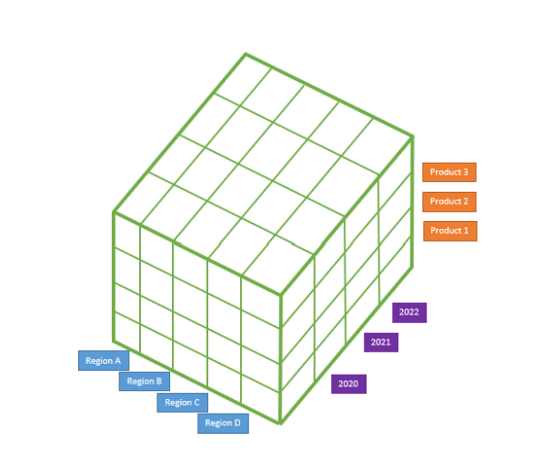

# INTRODUCTION A L'ENTREPOSAGE DE DONNEES/DATA WAREHOUSING

## **LES BASES DU DATA WAREHOUSE**

### C'est quoi un entrepot de données ?

Il s'agit tout simplement d'un système informatique conçu pour stocker et analyser de grandes quantités de données pour une organisation.

Il rassemble des données provenant de divers domaines d'une organisation. Ensuite, il intègre et stock ces données et les disponibles pour analyse.

Elle est construite dans l'objectif de :
- soutenir les activités de renseignement, tels les KPIs
- conduire la prise de décision organisationnelle, avec l'object de trouver des moyens d'innover en se basant sur les informations tirées des données après analyses.

### Différences Data Warehouse, Data Mart et Data Lake

Les BD utilisent des tables pour stocker des informations de manière structurée avec des lignes et colonnes. Et donc les organisations les utilisent pour stocker leurs différentes transactions; on les appele **BD transactionnelles**.

**Le Data Warehouse** rassemble des données provenant de différents domaines d'une organisation, les intègre et les rend disponibles pour analyse.

**Le Data Mart** est un peu comme le Data Warehouse mais à la difference, il stock les données d'un seul domaine de l'organisation et il est généralement extrait du Data Warehouse.

Le Data Lake, à la différence du Data Warehouse, peut aussi contenir des données non structurées.

### Analyse Organisationnelle de Data Warehouse

#### Cycle de vie d'un Projet de Data Warehouse

**La Planification**

C'est l'étape où l'équipe planifie comment concevoir le Data Warehouse pour repondre aux bésoins de l'organisation qui consiste à 
- colleter des infos pour comprendre les besoins de l'organisation, qui utilisera le Data Warehouse et comment.
- Modéliser les données: il s'agit de planifier en fonction des bésoins de l'organisation sur la façon dont on transforme les données et les intègre. (Data Engineer et Database Admin)

**L'Implementation**

C'est la phase de conception du Data Warehouse
- Conception du processus ETL, consiste à concevoir et construire les pipelines de données qui extraient, transforment et chargent les données des différentes sources dans l'entrepôt de données 
- Developpement de l'application BI, mise en place des outils BI pour interagir avec l'entrepot de données et créer des rapports nécessaires à l'organisation.

**Support/Maintenance - Test & Deployement**

C'est la phase où l'équipe forme les utilisateurs finaux et maintient le warehouse.
- Test les Data Analyst et Scientist testent le système pour confirmer que leurs exigences commerciales sont satisfaites
- Le Data Engineer deploie met l'entrepot de données à la disposition de l'organisation. Après le déploiement, toute modification importante suivra les mêmes étapes à partir de la phase de planification.

#
## **ARCHITECTURE ET PROPRIETES DE L'ENTREPÔT**

### **Differentes Couches d'un Data Warehouse**

#### **Les couches**

**N°01 : Data Source**, Celle-ci contenant la source de données
- les fichiers 
- les BD

**N°02 : Data Staging**, C'est là que se trouvent toutes les données pendant la phase de l'ETL. Le processus ETL lui même les met en staging ou temporairement dans des tables afin qu'elles soient pretes à être utilisées dans les étapes ulterieures. Cette couche génère des données prêtes à être stockés.

**N°03 : Data Storage**, Ici, les données sont stockés dans l'entrepôt de données. Il contient également tous les Data Mart utilisés.

**N°04 : Data Presentation**, C'est là que les données sont mis à disposition des utilisateur finaux.
C'est à partir de cette couche que les utilisateurs intéragissent avec les données stockées, que les requêtes sont exécutées pour faciliter l'analyse.
Cette couche comprend également 
- des outils BI, 
- des outils d'EDA
- les requêtes utilisateur directes

### **L'Architecture**

Nous en parlerons de deux (02)

**1- L'architecture Top-Down ou Approche descendante** propulsée par Bill Inmon

Bill considerait l'entrepôt de données comme un outil permettant de contenir les données de l'organisation. L'éssentiel de cette architecture est que l'organisation doit décider de **la dénomination**, **la définition**, **les données à valider s'il y a des conflits** et toutes les autres opérations sur toutes les données avant qu'elles n'entrent dans l'entrepôt de données.

En plus, cette architecture stocke les données dans l'entrepôt sous forme normalisée

Les données sont ensuite transférées vers les Data Mart axés sur le service où les utilisateurs finaux et les applications peuvent les intérroger. 

**Ses avantages** 
- La conformité des sources de données d'entrée en definition unique que l'organisation s'accorde fait de l'entrepôt une source éfficace de vérité.
- Puisque les données sont normalisées dans l'entrepôt, moins de stockage est nécessaire
- la création de nouveaux Data mart est relativement simple.

**Désavantages**
- Etant données que les données sont normalisées, elle necessitent davantages de jointures pour les rapports conduisant ainsi des réponses plus lentes
- Egalement, l'alignement de l'organisation sur la définition données peut necessiter beaucoup de travail initial et donc *Un coup de demarage élevé pour les projets de DW*.

**2- L'architecture Bottom-Up ou Approche ascendante** propulsée par Ralph Kimball

Dans cette approche, l'accent est mis sur le passage des données aux rapports rapidement que possible.

Une Fois les données introduites, elles sont denormalisées dans un schéma en étoile. ***Le schéma en étoile** est un moyen de stocker des données qui rend l'écriture de requêtes simple et rapide*.

### **L'Architecture**

Nous en parlerons de deux (02)

**1- L'architecture Top-Down ou Approche descendante** propulsée par Bill Inmon

Bill considerait l'entrepôt de données comme un outil permettant de contenir les données de l'organisation. L'éssentiel de cette architecture est que l'organisation doit décider de **la dénomination**, **la définition**, **les données à valider s'il y a des conflits** et toutes les autres opérations sur toutes les données avant qu'elles n'entrent dans l'entrepôt de données.

En plus, cette architecture stocke les données dans l'entrepôt sous forme normalisée

Les données sont ensuite transférées vers les Data Mart axés sur le service où les utilisateurs finaux et les applications peuvent les intérroger. 

**Ses avantages** 
- La conformité des sources de données d'entrée en definition unique que l'organisation s'accorde fait de l'entrepôt une source éfficace de vérité.
- Puisque les données sont normalisées dans l'entrepôt, moins de stockage est nécessaire
- la création de nouveaux Data mart est relativement simple.

**Désavantages**
- Etant données que les données sont normalisées, elle necessitent davantages de jointures pour les rapports conduisant ainsi des réponses plus lentes
- Egalement, l'alignement de l'organisation sur la définition données peut necessiter beaucoup de travail initial et donc *Un coup de demarage élevé pour les projets de DW*.

**2- L'architecture Bottom-Up ou Approche ascendante** propulsée par Ralph Kimball

Dans cette approche, l'accent est mis sur le passage des données aux rapports rapidement que possible. *Cela se fait en organisant et en definissant d'abord les définitions de données d'un departement de l'organisation, en plaçant les données dans un Data Mart et en les rendant disponible pour les rapports*.

Une Fois les données introduites, elles sont denormalisées dans un schéma en étoile. ***Le schéma en étoile** est un moyen de stocker des données qui rend l'écriture de requêtes simple et rapide*.

Par la suite les Data Mart sont intégrés dan le DW.

**Avantages**
- Il peut être rapidement opérationel en adoptant une approche incrementielle, d'où la reduction des coûts initiaux des projets d'entreposage.
- Le modèle de données décentralisé rend les données facile à consommer par les utilisateurs.

**Desavantages**
- La décentralisation augmente le temps de traitement au sein de l'ETL et peut créer des doublons lorsque les données sont utilisées dans différents Data Marts
- Il necessite un coût minimum mais requièrt plus d'entretien.

***Et donc, lors de la création d'un Data Warehouse, il est important de prendre en compte les forces et faiblesses de chaque architecture et les confronter avec nos objetifs de projet afin de produire un résultat éfficient.***

### **SYSTEMES OLAP ET OLTP**

#### **OLAP**
OLAP : *OnLine Analytical Processing ou Traitement Analytique en Ligne*

Il s'agit d'un outil permettant de faire des analyses multidimensionnelles à grande vitesse sur des grans volumes de données provenant d'un DW, DM ou toute autre source. Ils sont optimisés pour l'analyse.

**Le Cube OLAP** : Au coeur du système OLAP se trouve le cube de données OLAP, une base multidimentionnelle qui le permet de traiter et d'analyser plusieurs dimensions de données plus rapidement qu'une BD relationnelle traditionnelle.

Pour exemple : imaginons que nous nous intéressons aux ventes d'une entreprise par région, année et produit.

Si nous imagninons un cube, les différentes arrètes du cube ou la largeur, la longueur et la hauteur représenteront l'une ces dimensions. Nous aurons alors le total des ventes pour les dimensions où ces bords se croisent.

Le cube de données peut explorer ou agréger les ventes totales par chaque dimensions.

Ici, les dimensions sont la région, l'année, le produit et le total des ventes est la valeur qui est agrégée ou desagrégée en fonction des dimensions sélectionnées.

**Hypercube** : les cubes de données ayant plus de trois dimensions sont appelés hypercube.

### **OLTP**

OLTP : *OnLine Transaction Processing ou Traitement des Transactions en Ligne*

Il est optimisé pour le traitement de grands volumes de données de transactions et requêtes de bases de données simple aussi rapidement que possible.

Les utiisations typiques des systèmes OLTP inclus les terminaux de paiement et les réservations.

Les requêtes pour les systèmes OLTP ont tendence à n'affecter que quelques ligne de données dans la BD. Ils sont souvent critiques pour l'entreprise et ne sont pas utilisés pour l'analyse.

***Un exemple Concrêt*** : 
Dans une entreprise de carte crédit, un système OLTP peut suivre l'achat de chaque client et met à jour son solde actuel. Ce système permettra de suivre des milliers d'achats et leur mis à jour chaque seconde mais pas pour analyser les habitudes d'achat des client.

### **En resumé**

OLAP est conçu pour prendre en charge l'analyse des données, exécuter des requêtes complexes de BD relationnelles volumineuses tandis que OLTP est conçu pour être très rapide à effectuer des requêtes simples qui se concentrent sur quelques lignes de données.

<<<<<<< HEAD
## **Modelisation des Données Dans le DW**
=======
## Modelisation des Données Dans le DW
>>>>>>> ff199a4c98e7a91b6bfe0bb14f4af9988efa74e4

**La modélisation** fait référence à la manière dont nous organisons les données dans une base de Données.

Parlans de modélisation, les schémas en étoile(star) et en flocon de neige (Snowflake) sont deux(02) approches courantes pour un DW utilisant l'approche ascendante de Kimball pour organiser les données.

Ces modèles de données dénormalisent les données organisationnelle en tables de dimensions et tables de faits.

**Une table de faits** se compose de mesures ou metriques sur un processus organisationel.

**La table de dimension** contient des attributs et caractéristiques qui décrivent les données de la table de faits. 

**Un schéma en étoile** est une structure organisationnelle qui utilise une seule table de fait et une ou plusieurs tables de dimension.

**Un schéma en flocon de neige (snowflake)** est similaire à un schéma en étoile. Cependant au moins une des tables dimentionelles n'indique pas directement une jointure à la table des faits mais par une jointure avec une autre table de dimension.

### Etapes du processus de création d'une architecture de KIMBALL (schema en étoile ou snowflake)

**1- Selectioner un processus organisationnel** pour lequel nous souhaitons créer le modèle de données(Ex. Facturation, surveillance qualité ou marketing)

*Pour rappel l'approche de KIMBALL modelise d'abord un service ou un processus métier pour créer un Data Mart.*

**2- Decider du grain**. Le grain désigne le niveau de donnnées stocké dans la table des faits. Il n'est pas obligatoire mais il s'agit du niveau le plus bas possible, essentiellement un niveau où il n'est plus possible de diviser les données. 

Pour faire simple, il faut que la table faits traite les données ou opérations du service/processus de manière individuelle, sinon le DM rique d'être inutile ou moins precieux.

**3- Choisir les dimensions qui s'appliquent à chaque ligne de la table de faits**.

Repondre à la question "Comment les utilisateurs de l'organisation décrivent les données resultants des processus métiers ?" aide à reussir cette étape.

**4- Identifier les faits numériques qui rempliront chaque de la table de faits**.

Demander aux utilisateurs de repondre à la question "à quoi repondons-nous?" aide à identidier les faits chiffrés à inclure.

*Rappelons que le but du DW est de rendre compte et d'analyser le processus organisationel. Nous devons aussi decider des mesures numériques essentilles à stocker pour repondre ulterieurment aux questions probables sur le processus.*

*Enfin, le fait ou la métrique choisie doit être valide au grain selectionné à l'étape 02.*

***Attention, il faut également faire attention à prendre enconsideration le fait cetaines données des tables de dimensions changent sur le long terme.***

## **IMPLEMENATION ET PREPARATION DES DONNEES**

## **ETL et ELT**

**ETL - Extract Transform Load** fait les transformation dans un autre système extérieur avant d'être intégré dans le DW et donc le temps de traitement avant d'avoir les données disponibles dans le DW est long

**ELT - Extract Load Tranform** commence par importer les données dans le DW avant de faire les traitements/transformation et donc il nécessite des coûts élevés pour la conception de DW mais son avantage est que les changements dans le processus de transformation des données se font assez facilement sans quitter l'écosystème du DW vers la sources primaire des données.