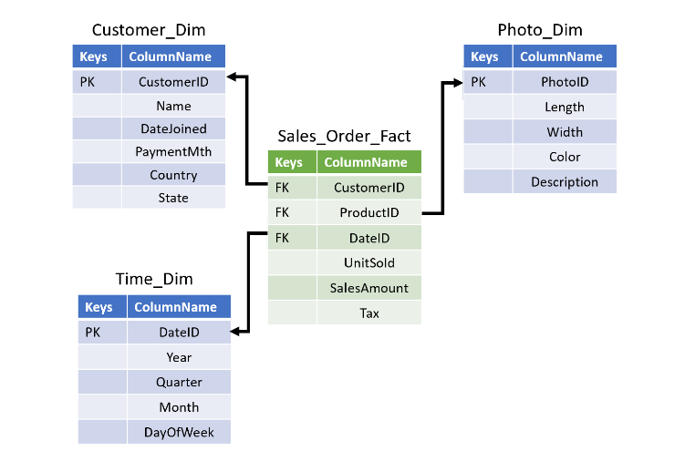

# ETUDE DE CAS : CONCEPTION D'UN DATA WAREHOUSE

**Contexte** : Nous travaillons pour une nouvelle startup qui a developpée une application de partage de photos que les photographes utilisent pour vendre leur photos.

Notre rôle est de concevoir et déployer un entrepôt de données pour l'entreprise.

**Etape 01 - Choix de l'architecture** :

- En tant que StartUp, nous devons presenter des résultats commerciaux aussi rapidement que possible
- Une approche descandante présente de nombreux avantages, mais le temps de mise en oeuvre a tendance à être plus long par rapport à une approche ascendante. Par conséquent nous optons pour une approche ascendante.

- De plus, le service de vente a été signalé dans notre collecte d'exigences comme piorité pour l'entrepôt de données.

**Etape 02 - Modélisation des données** :

Etant donnée que nous avons choisi une approche ascendante, nous utiliserons probablement un snowflake un schema en étoile. Nous pouvons donc utiliser le processus en quatre étapes de KIMBALL pour concevoir nos tables.

- 1. **Selection du processus organisationel**

Notre collecte d'exigences a révélé que le service de vente essaie demieux comprendre quels types de clients achètent des photos à partir de l'application. En outre, ce service souhaite analyser les données pour hiérachiser les clients auxquels il s'adresse. 

Par conséquent, nous nous concentrons de tables de faits et de dimensions qui suivront les achats des clients.

- 2. **Déclaration du grain de données**

Dans notre cas, le suivi de chaque achat par un client sous la forme d'une ligne dans notre table de fait offrira le plus de flexibilité. De plus, il s'agit du niveau de détails le plus bas pour les achats.

- 3. **Identification des dimensions que nous allons suivre**

Encore une fois nous essayons de donner la priorité aux clients.

Nous refléchissons à la manière à la façon dont les autres utilisateurs décriventles données qui resultent de la priorisation des clients par le service de vente.

Certaines caractéritiques importantes sont **l'emplacement du client**, la **date d'adhésion** et le **mode de paiement** par défaut.
De plus nous aurons une table de dimension pour **les photos** et **les dates**.

- 4. **Identification des faits**

Pour déterminer les faits, nous devons nous poser la question "à quoi devons-nous repondre?"

Nous décidons de suivre **le temps passé à regarder une photo**, **quelle photo a été achetée** et **le coût de la photo**. Celles-ci donneront un aperçu des clients engagées que nous prevoyons d'acheter davantage.

Après avoir terminé ces quatres étapes, nous avons ce qui suit.

*NB : Il ne s'agit que d'un simple petit exemple, et donc il y en aurait beaucoup plus de tables dans un vrai exemple plus complexe.*

*Nous avons maintenant notre modèle de données avec un schéma en étoile et donc nous pouvons passer aux autres étapes de notre planification.*

**Etape 03 - Choix d'environement d'hébergement de notre Entrepôt de données** : 

Une autre décision que nous devons prendre de savoir si nous devons implémenter notre entrepôt de données On-Premise(En local) ou dans le cloud.

En tant que StartUp, nous sommes limité financièrement pour pouvoir dépenser pour l'infrastructure en amont, et nous avons tendanceà avoir de pétites équipes. Par conséquent, nous optons pour une implémentation dans le cloud afin que notre équipe puisse se concentrer sur des activités  à forte valeur ajoutée.

**Etape 04 - Choix du procéssus à utiliser (ETL ou ELT)** :

Nous donnons la priorité à la conservation d'autant de données que possible, car elles peuvent avoir une valeur future.

De plus, puisque nous utilisons une implementation dans le cloud, nous pouvons faire évoluer les ressources selon les besoins, ce qui permet d'économiser sur les coûts.

***Par conséquent, nous décidons d'une mise en oeuvre de l'ELT***.

*Cette planification est cruciale et nous devons donc nous concentrer sur la mise en oeuvre et le deploiement.*
*Nous pourions répéter ce même cycle pour d'autres services.*