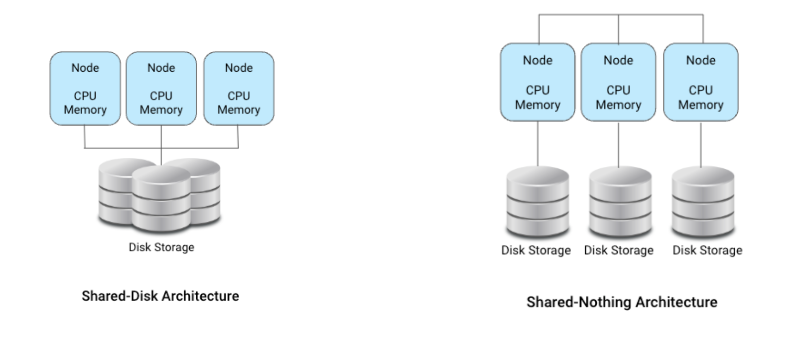
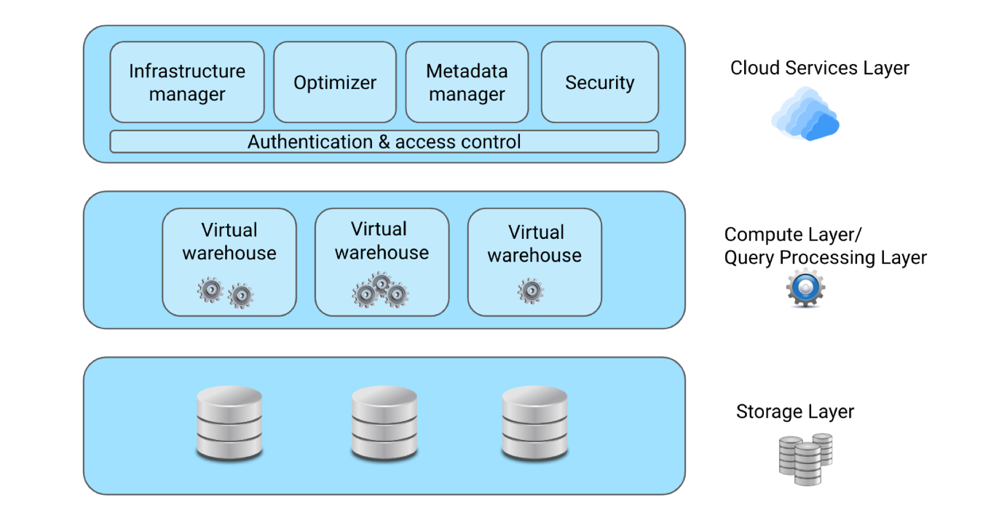

*Ceci est un tutoriel que je fais pour presenter de façon succinte Snowflake*

# Architecture, Competitors, and SnowflakeSQL

## C'est quoi Snowflake ?

Snowflake est un entrepôt de données basé sur le Cloud qui utilise un modèle de stockage de données en colonnes.

***Mais qu'est-ce que cela signifie exactement ?***
Pour rappel, un entrepôt de données classique est comme une bibliotèque avec une collection bien organisée de livres, classés en cotégories. De même, il contient et organise les données provenant de différents endroits.
Cependant, plus nous ajoutons de livres, plus nous avons bésoin d'espace et de ressources. C'est le cas pour les entrepôt de données.

Le Cloud permet bien d'avantages, à savoir :
- Evolutivité 
- accéssibilité
- Rapport coût-efficacité
- Diminution des efforts de gestion.

*Parlons maintenant du stockage en colonne*
Contrairement aux BD orientées ligne comme Postrgres qui stockent les informations par ligne, les BD en colonnes ou orientés colonnes stockent les données par colonnes. c.à.d que les informations de chaque colonne sont stockées ensemble.

Sa particularité est que lorsque nous devons mener des analyses, nous ne recupèrons que les colonnes qui nous pertinantes, ci qui rend la repéraction plus éfficace alors qu'avec la BD orientée ligne nous recupérons tous les enregistrements, qui lui est plus optimisé pour les opérations transactionnelles.

Alors, ***Snowflake combine la puissance de la technologie cloud, l'entreposage de données et le stockage de données en colonne pour fournir une solution puissante et évolutive pour l'analyse des données***.

Conçu pour le cloud, il offre une évolutivité et une flexibilité élevées. En organisant les données en colonnes, les requètes s'exécutent beaucoup plus rapidement, permattant ainsi des performances et une efficacité améliorées.

Il a une capacité unique à se connecter à plusieurs fournisseurs de cloud tels AWS, Google Cloud Plateform ou Azure.

Les entreprises l'utilisent largement pour des analyses avancées et le BI, permettant une prise de décision basée sur les données.

Avec Snowflake, nous pouvons stocker, transformer et gérer éfficacement les grands ensembles de données. De plus, il excelle dans l'intégration et l'analyse transparente de diverses sources de données.
Aussi, les possibilités de partages de données permettent de faciliter la collaboration et l'échange de données entre différentes équipes et organisations.

Avec sa large gamme de fonctionnalités, il devient un atout  indispensable pour les organisations à la recherche de solutions complètes de gestion de données.

## Architecture

Avant de parler de l'architecture, parlons du stockage et du calcul, ou de la manière dont les données sont stockées et traitées.

##### Disque partagé et sans partage
Traditionnellement, de nombreuses bases de données suivent une architecture "Disque partagé", comme suit.

Sur l'image de gauche, chaque noeud (pensez à un processeur ou un ordinateur) possède sa propre mémoire et son propre CPU, mais ils partagent le même stockage, permettant à n'importe quel noeud de lire ou d'écrire sur n'importe quelle partie du stockage partagé.

Sur celle de droite, l'architecture sans partage sépare le stockage et le calcul. Ici, chaque noeud possède son propre stockage. Il s'agit d'un concept clé appelé "**découplage de stockage et du calcul**".
Cela garantit que
- Le stockage et le traitement des données est éfficace 
- Le traitement des données se fait indépendamment
- chaque composant peut fonctionner sans dépendre de l'autre.

Et bien, ***c'est ce concept de découplage qu'adopte Snowflake***. D'ou les véritables avantages
- Evolutivité améliorée
- Snowflake peut stocker beaucoup plus de données et/ou les traiter plus rapidement de manière indépendante
- Et donc, des réponses plus rapides et des opérations plus rentables.

Voici un aperçu des conposants fondemmentaux de l'architecture unique de Snowflake.

Il est aussi important de noter que Snowflake utilise une architecture hybride. C.à.d qui bien qu'il dispose d'une couche de stockage partagée centralisant toutes les données, son informatique est nettement découplée.

*Essayons d'examiner chaque couche.*
* **La couche de stockage - Storage Layer**

Lorsque les données sont chargées dans Snowflake, il les organise dans un format de stockage en colonnes, ce qui lui permet une recupértion et une analyse éfficaces des données comme nous l'avons mentionner plutôt.
De plus, Snowflake s'occupe de toutes les optimisations et compressions internes, ce qui signifie qu'il organise et réduit automatiquement la taille de nos données pour en faciliter l'accès et l'analyse. Pas besoin de le faire manuellement.

Cette couche se compose de tables, schémas et de bases de données, fournissantune organisation structurée à nos données. Cela facilite la gestion et la récupération des informations dont nous avons bésoin.

* **La couche de calcul - Compute Layer**

C'est l'endroit où les requètes sont traitées et transformées en informations précieuses.
C'est en fait la salle des machines de Snowflake :smile:, où toute la magie opère! 
Snowflake utilise ce qu'on appelle des entrepôts virtuels pour y parvenir. Ce sont des ressources informatiques temporaires créées lorqu'on soumet une requète. On peut les considérer comme des ordinateurs spécialement conçu pour gérer le traitement des requètes.
Ces entrepôts virtuels peuvent être agrandis ou reduits selon les besoins : **évolutivité**.
Ils sont conçu pour des performances optimales donc ils fournissent des resultats de requètes rapides : **Performances**.
Nous payons uniquement pour les entrepôts virtuels que nous utilisons afin d'économiser de l'argent sur mes coûts d'entrposage des données.

- **Les services Cloud - Cloud Services Layer**

Celle-ci garantit que lorsque nous exécutons une requète, les bonnes ressources, le calcul et le stockage sont alloués éfficacement pour obtenir des résultats plus rapides.
Il est également chagé de maintenir la sécurité de nos données et de contrôler l'accès aux données.
Essentiellement, cette couche agit comme le chef d'orchestre, coordonant tous les aspects de Snowflake pour offrir une expérience utilisateur fluide, sécurisée et fiable.